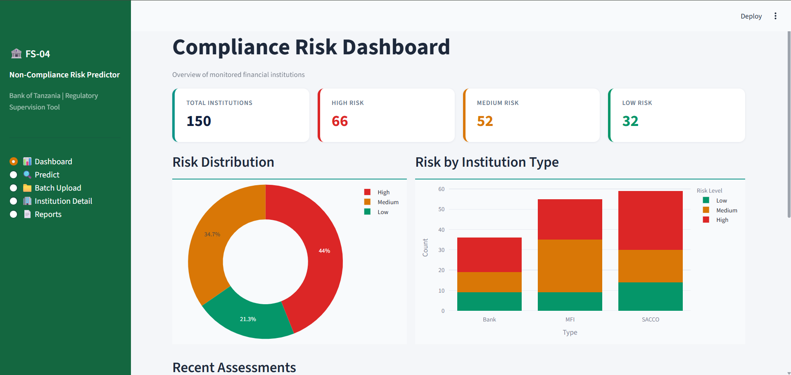

# Non-Compliance-risk-predictor-for-Financial-Institution

## Overview

This project uses Machine Learning to predict the likelihood of non-compliance risks within financial institutions. The system helps identify high-risk cases early, enabling proactive monitoring and regulatory compliance management.

## Features

- Risk prediction using Machine Learning
- Data preprocessing and feature engineering
- Interactive Streamlit dashboard
- Real-time prediction interface
- Visualization of risk levels

## Technologies Used

- Python
- Pandas
- NumPy
- Scikit-learn
- Streamlit
- Matplotlib

## Project Workflow

1. Data Collection
2. Data Cleaning and Preprocessing
3. Model Training
4. Model Evaluation
5. Deployment using Streamlit

## Model Performance

Include metrics such as:

- Accuracy
- Precision
- Recall
- F1 Score
- ROC-AUC

## Running the Application

Install dependencies:

```bash
pip install -r requirements.txt'
```
Run Streamlit:
```
streamlit run app.py
```
Dashboard Preview



Future Improvements
Integration with live compliance databases
Explainable AI features
Automated compliance reporting
Real-time monitoring
Author

Fridolin

Data Science and Artificial Intelligence Student


---
